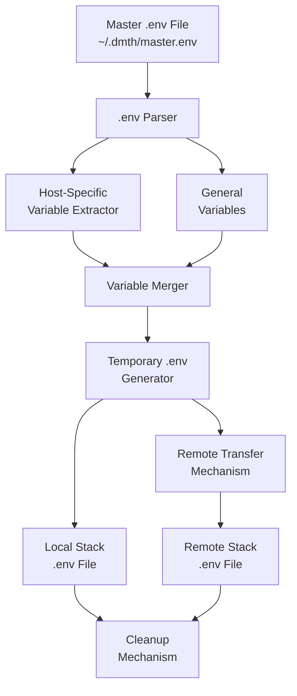
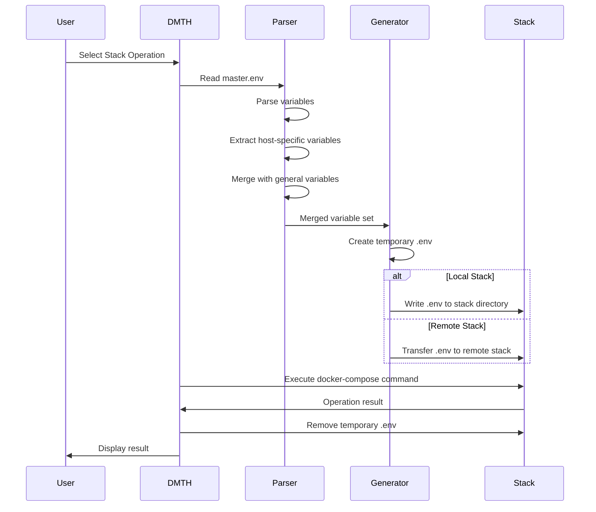
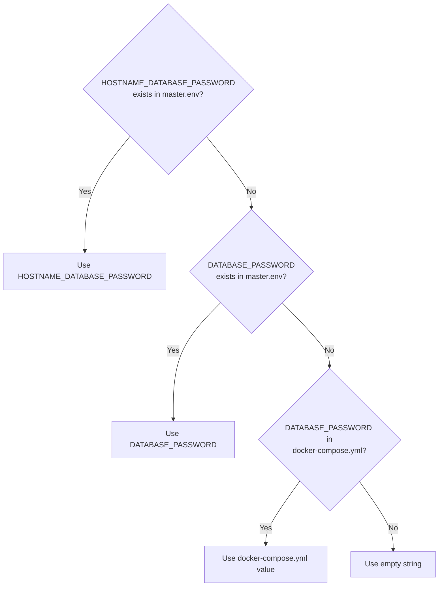
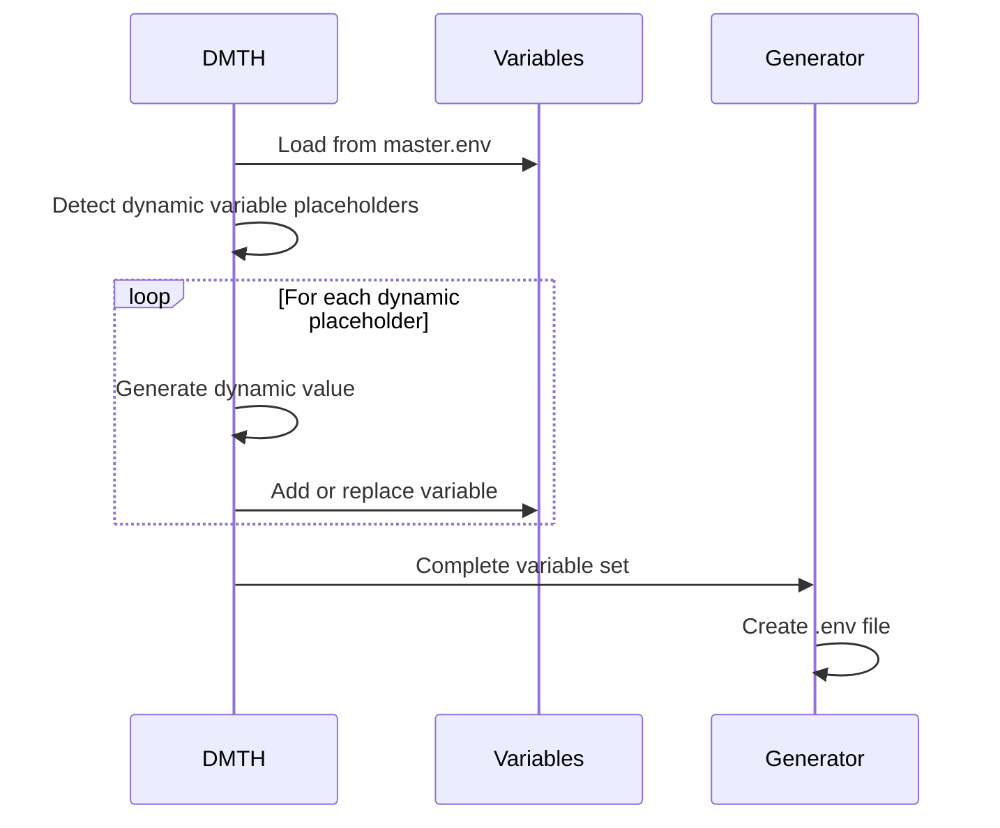
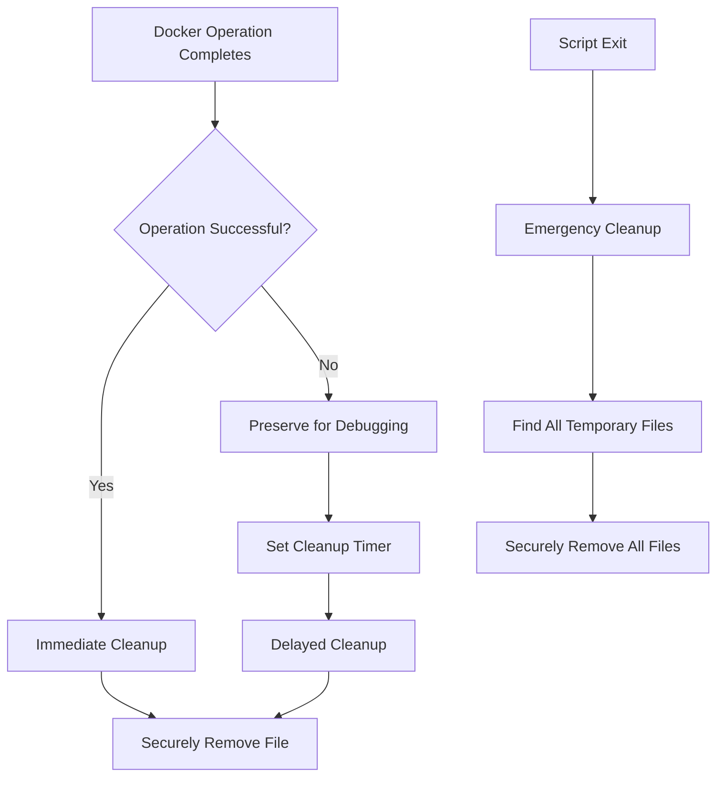

# Environment Variable Management System

This document outlines the design for the environment variable management system in the Docker Management TUI Helper (DMTH).

## System Overview



## File Structure & Organization

### Master .env File

The master .env file (`~/.dmth/master.env`) serves as the central repository for all environment variables across all hosts. This file follows this structure:

```
# General variables (applied to all hosts)
VARIABLE1=value1
VARIABLE2=value2

# Host-specific variables (prefixed with uppercase hostname)
HOSTNAME1_VARIABLE3=host1_value3
HOSTNAME1_VARIABLE4=host1_value4
HOSTNAME2_VARIABLE3=host2_value3
HOSTNAME2_VARIABLE4=host2_value4
```

### Security Measures

1. **File Permissions**
   - Set restrictive permissions on master.env: `chmod 600 ~/.dmth/master.env`
   - Ensure temporary .env files are created with secure permissions
   - Immediately clean up temporary files after use

2. **Optional Encryption**
   - Support for GPG encryption of master.env
   - Decryption on demand using user passphrase
   - Never store decryption key

## Variable Processing Flow



## Variable Override Mechanism

The system implements a cascading precedence for environment variables:

1. Host-specific variables in master.env (highest precedence)
2. General variables in master.env
3. Existing variables in the stack's docker-compose.yml
4. System environment variables (lowest precedence)

Example resolution for variable `DATABASE_PASSWORD`:



## Dynamic Variable Generation

In some cases, variables may need to be dynamically generated rather than stored in the master.env file.

### Dynamic Variable Types

1. **Timestamp Variables**
   - `DMTH_TIMESTAMP`: Current timestamp
   - `DMTH_DATE`: Current date in YYYY-MM-DD format

2. **Host-based Variables**
   - `DMTH_HOSTNAME`: Current hostname
   - `DMTH_HOST_IP`: IP address of current host

3. **Random Values**
   - `DMTH_RANDOM`: Random string for temporary purposes
   - `DMTH_UUID`: Generated UUID

### Implementation

Dynamic variables are generated at runtime before the temporary .env file is created, using this process:



## Temporary File Management

### Creation Process

1. Generate a unique filename with timestamp and random component
2. Create file with secure permissions (0600)
3. Write processed variables to file
4. Use file for docker-compose operation
5. Schedule file for cleanup

### Cleanup Process



## User Interface for Environment Management

### View Environment Variables

```
┌─────────────────────── Environment Variables ───────────────────────┐
│                                                                     │
│  General Variables:                                                 │
│    TZ = Europe/Dublin                                               │
│    PUID = 1000                                                      │
│    PGID = 1000                                                      │
│                                                                     │
│  Host-Specific Variables (castle0):                                 │
│    DATA_DIR = /mnt/data/castle0                                     │
│    SYNC_PORT_GUI = 8384                                             │
│                                                                     │
│                                                                     │
│                      <View>            <Back>                       │
│                                                                     │
└─────────────────────────────────────────────────────────────────────┘
```

### Edit Environment Variables

```
┌─────────────────── Edit Environment Variable ────────────────────┐
│                                                                  │
│  Variable Name: DATA_DIR                                         │
│                                                                  │
│  Current Value: /mnt/data/castle0                                │
│                                                                  │
│  New Value: /mnt/data/castle0                                    │
│                                                                  │
│                                                                  │
│              <Save>            <Cancel>                          │
│                                                                  │
└──────────────────────────────────────────────────────────────────┘
```

## Implementation Considerations

1. **Error Handling**
   - Validate variable format in master.env
   - Handle missing master.env gracefully
   - Provide clear error messages for malformed variables

2. **Performance**
   - Cache parsed master.env to avoid repeated parsing
   - Invalidate cache when master.env is modified

3. **Extensibility**
   - Support for different .env formats
   - Allow custom variable processing plugins
   - Support for future encryption methods 
