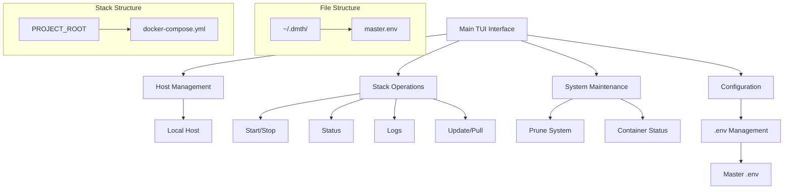

# Project Title: Docker Management TUI Helper (DMTH)

1. Introduction & Vision

To develop a lightweight, TUI-based (Text User Interface) command-line tool using whiptail for simplifying daily Docker container and Docker Compose management tasks. The tool will operate primarily via Bash/sh scripts, with Python as an acceptable alternative for more complex logic. The paramount design goals are simplicity, ease of use, and efficient workflow for managing Docker environments on the local machine.

2. Core User Needs & Goals

Unified Interface: Provide a single, intuitive interface to manage Docker resources without needing to remember or type out lengthy Docker commands.
Streamlined Stack Operations: Easily start, stop, update, and view the status of Docker Compose stacks.
Centralized & Secure Configuration: Manage environment variables for Docker Compose projects from a master file, ensuring sensitive data is handled appropriately.
Quick Status Checks: Quickly get an overview of running containers and stack health.

3. Key Features & Functionality

3.1. Host Management
* Local Host Detection: Automatically identify the current hostname (e.g., using hostname).
* TUI Host Selection: The main interface will allow users to select the target project for subsequent operations.

3.2. Docker Compose Project Structure
* Compose files are expected to be organized in a single PROJECT_ROOT directory (e.g., docker-compose.yml).
* The tool should allow selection from multiple Docker Compose projects/stacks if found within the PROJECT_ROOT directory.

3.3. Docker & Docker Compose Operations
* Stack Management:
* List Stacks: Display available Docker Compose projects.
* Start Stack: Execute docker-compose up -d.
* Stop Stack: Execute docker-compose stop.
* Restart Stack: (Typically docker-compose stop then docker-compose up -d, or docker-compose restart).
* Down Stack: Execute docker-compose down (optionally with -v for volumes).
* Container & Stack Updates:
* Pull Images: For a selected stack, pull the latest images for all services (docker-compose pull).
* Update & Recreate Stack: Pull latest images and then recreate services (docker-compose up -d --remove-orphans --force-recreate).
* Status & Information:
* Stack Status: Display output of docker-compose ps for the selected stack.
* Container Status: Display output of docker ps -a (formatted for readability in TUI).
* View Logs: Stream logs for a selected stack or specific service within a stack (docker-compose logs -f --tail=N [service_name]).
* System Maintenance:
* Prune System: Offer options for docker system prune -af (with clear warnings).

3.4. Environment Variable Management (.env files)
* Master .env File:
* A single, master .env file (e.g., ~/.dmth/master.env) will store all common environment variables.
* Secure Storage/Handling:
* The master.env file should have its permissions restricted (e.g., chmod 600).
* Option A (Simpler): Rely on file permissions.
* Dynamic .env Generation:
* Before executing docker-compose commands for a specific stack, the tool will:
1.  Read the master.env file.
2.  Generate a temporary .env file in the target stack's directory. This file will be used by Docker Compose.
3.  This generated .env file should be cleaned up after the operation if it contains sensitive data and is not meant to persist.

3.5. TUI (Text User Interface) - Whiptail
* Main Menu:
* Select Project
* Global Settings (if any)
* Exit
* Project-Specific Menu (after project selection):
* Manage Docker Compose Stacks
* View All Container Status
* Docker System Prune
* Back to Main Menu
* Stack Management Menu (after selecting "Manage ... Stacks"):
* List available stacks
* Select a stack to perform actions on.
* Stack Action Menu (after selecting a stack):
* View Status
* Start
* Stop
* Restart
* Pull Images
* Update & Recreate
* View Logs
* Down Stack
* Back
* Use appropriate whiptail dialogs (menus, checklists, input boxes, message boxes, yes/no) for intuitive interaction.
* Provide clear feedback and progress indicators for operations.

3.6. Installation & Execution
* Installation via `make install` that creates a symlink to the entry script in a common PATH directory
* Launch globally from anywhere using the command `dockermenu`
* Entry script with proper permissions and dependency checking

4. Non-Vital / Optional Features (Future Enhancements)

Git Integration for Compose Files: Option to perform a git pull within a stack's directory before updating, if the stack is managed under version control.
Advanced Configuration Validation: More robust checking of configuration files.
Docker Compose Standardization: Tools to standardize Docker Compose files to use version 3.8 and follow consistent patterns.

5. Technical Requirements & Constraints

Primary Language: Bash/sh.
Alternative Language: Python (for specific modules if Bash becomes too cumbersome, e.g., complex parsing or if a Python TUI library offers significant advantages over direct whiptail scripting for certain views).
TUI Library: whiptail.
Dependencies: docker, docker compose plugin, whiptail, hostname. The script should perform a dependency check on startup.
Configuration Storage:
Main script location: User-defined.
Configuration directory: ~/.dmth/ (e.g., for master.env).
Compose file base directory: User-configurable, e.g., ~/docker-projects/.
Error Handling: Implement comprehensive error checking for all external commands. Provide clear, user-friendly error messages.
Security: Prioritize secure handling of credentials and sensitive data. Minimize storage of plain-text secrets.

6. Guiding Principles

Simplicity over Features: If a feature adds significant complexity for marginal benefit, it should be reconsidered or deferred.
Daily Usability: The tool must be fast, responsive, and intuitive for frequent use.
Non-Intrusive: The tool should work with existing Docker and Docker Compose setups without requiring major changes to them.
Idempotency (where applicable): Operations should be safe to run multiple times.

7. Docker Compose Standardization

Docker Compose V3.8 should be the standard used for all compose files.
Standardized service layout and base services should be implemented.
External data drives should be maintained to allow for remote backup.
Logging should be kept and accessible.
Docker installation should be accommodated. 
