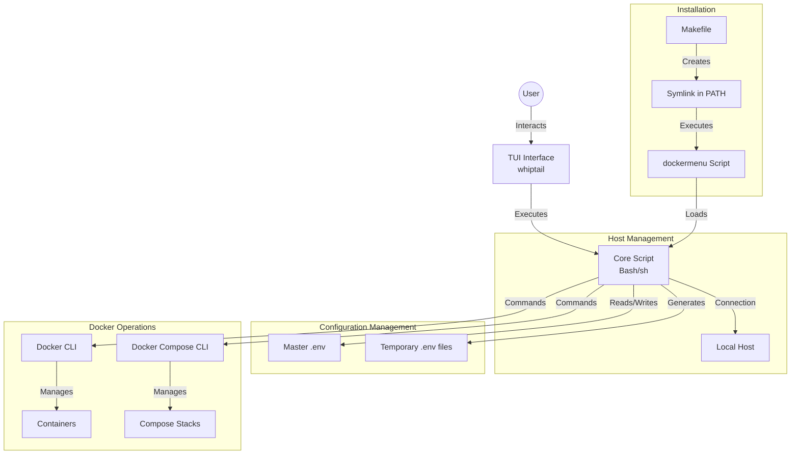
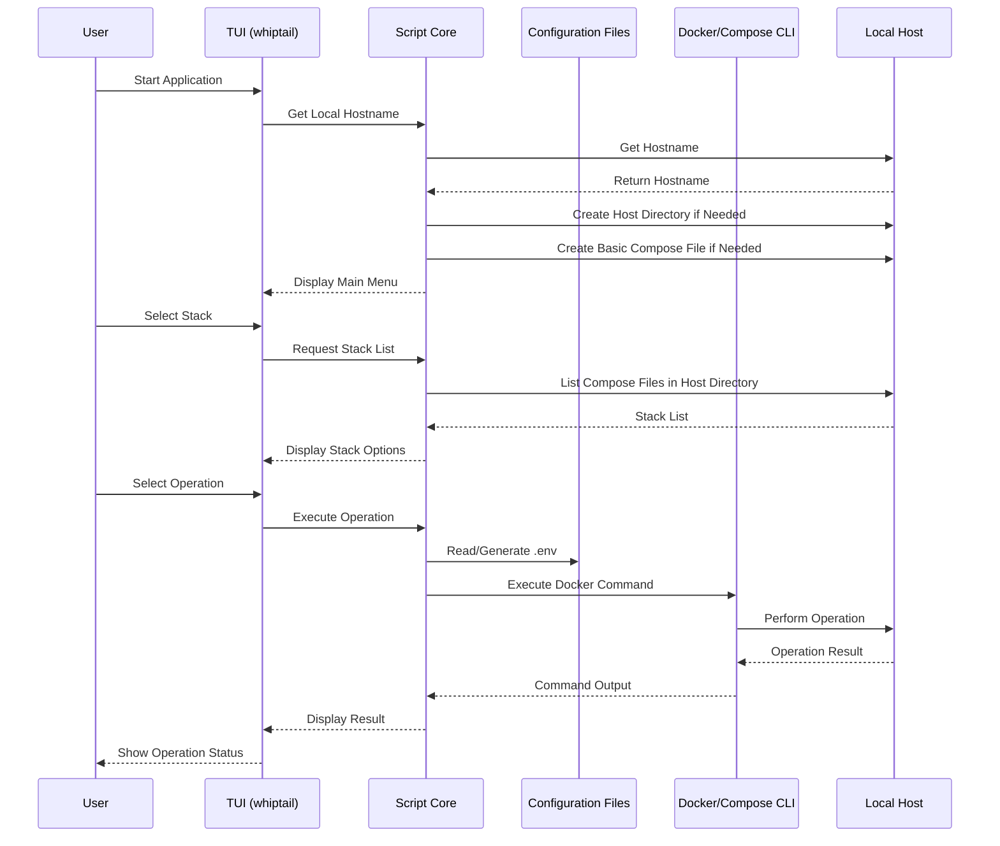
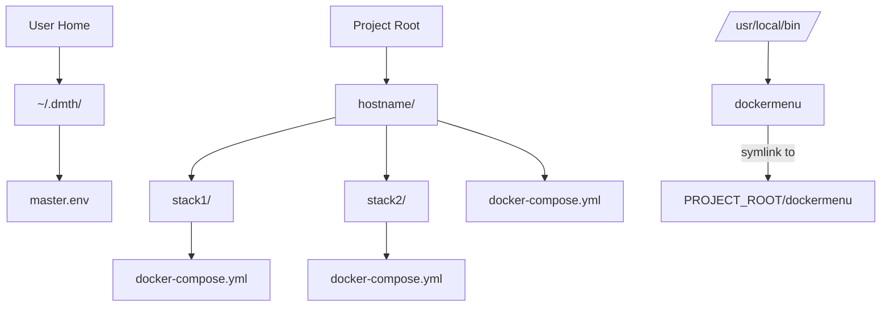
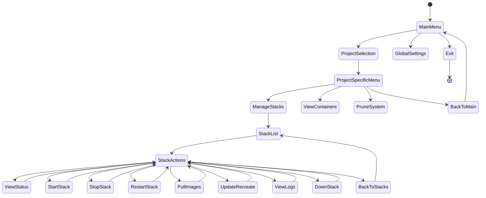
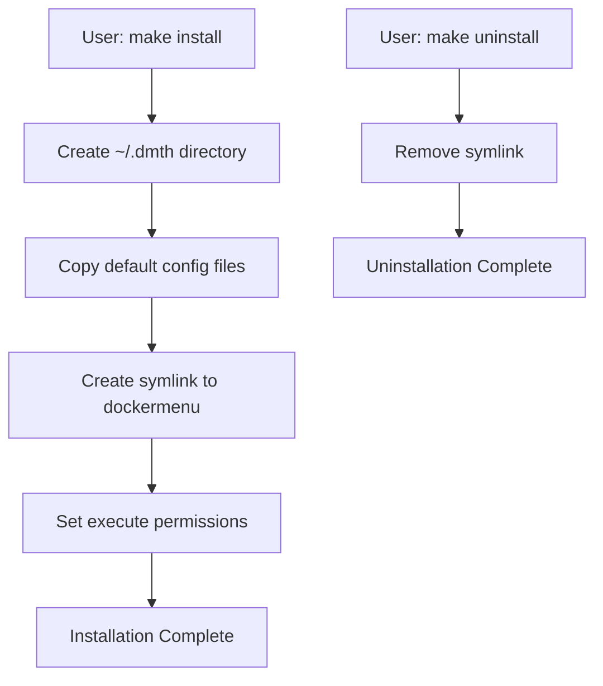
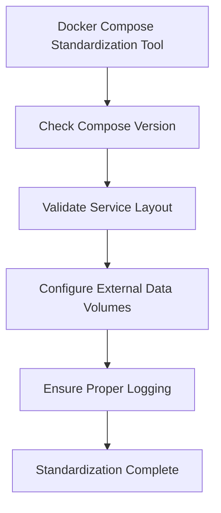

# Docker Management TUI Helper (DMTH) - System Architecture

## System Components

## Data Flow

## Directory Structure

## TUI Navigation Flow

## Installation System

## Docker Compose Standardization

