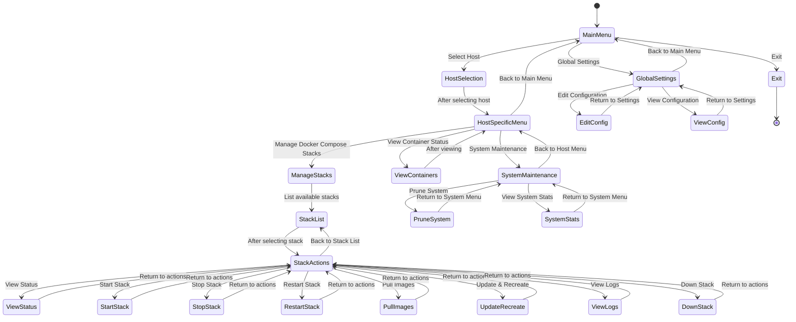

# TUI Navigation Flow Design

This document outlines the navigation structure for the Docker Management TUI Helper (DMTH) interface using whiptail.

## Navigation Hierarchy

## Menu Structure Details

1. **Main Menu**
   - Select Host (Local / Remote Host 1 / ...)
   - Global Settings
   - Exit

2. **Host Selection Menu**
   - Local Host
   - [List of configured remote hosts]
   - Back

3. **Host-Specific Menu**
   - Manage Docker Compose Stacks
   - View All Container Status (on this host)
   - System Maintenance
   - Back to Main Menu

4. **Stack Management Menu**
   - [List of available stacks]
   - Back to Host Menu

5. **Stack Action Menu**
   - View Status
   - Start
   - Stop
   - Restart
   - Pull Images
   - Update & Recreate
   - View Logs
   - Down Stack
   - Back to Stack List

6. **System Maintenance Menu**
   - Prune System
   - View System Stats
   - Back to Host Menu

7. **Global Settings Menu**
   - Edit Configuration
   - View Configuration
   - Back to Main Menu

## Whiptail UI Components

| Menu Type      | Whiptail Component      | Description                         |
| -------------- | ----------------------- | ----------------------------------- |
| Main Menu      | `whiptail --menu`       | Standard menu for navigation        |
| Host Selection | `whiptail --menu`       | List of configured hosts            |
| Stack List     | `whiptail --menu`       | List of available stacks            |
| Confirmation   | `whiptail --yesno`      | Confirm destructive operations      |
| Information    | `whiptail --msgbox`     | Display operation results           |
| Log Viewer     | `whiptail --scrolltext` | Display logs with scroll capability |
| Help Text      | `whiptail --textbox`    | Display help information            |

## User Experience Considerations

1. **Breadcrumb Navigation**
   - Display current location in menu hierarchy
   - Example: "Main Menu > Host: myserver > Manage Stacks > web-app"

2. **Consistent Key Bindings**
   - Up/Down: Navigate menu items
   - Enter: Select item
   - Esc: Back to previous menu
   - Tab: Switch between options (when applicable)

3. **Error Handling**
   - Use clear error messages with suggestions for resolution
   - Provide option to retry or return to previous menu

4. **Progress Indicators**
   - Use progress bars for long-running operations
   - Display spinner for operations where progress cannot be determined

## Implementation Guidelines

1. **State Management**
   - Maintain navigation state in variables
   - Use functions for each menu level
   - Pass context between menu levels

2. **Input Validation**
   - Validate all user inputs
   - Provide clear error messages for invalid inputs

3. **Dynamic Content**
   - Refresh docker status information when returning to menus
   - Auto-detect changes in stack configurations

4. **Accessibility**
   - Support terminal resizing
   - Ensure proper visibility of all menu items
   - Handle small terminal windows gracefully