# MEMORY BANK SYSTEM: OPTIMIZATION JOURNEY

> **TL;DR:** The Memory Bank System evolved through multiple optimization rounds, from initial efficiency improvements to methodological integration with Claude's "Think" tool. The system now features mode-specific isolation, visual process maps, and a modular architecture that enables scalable, systematic development while maintaining context efficiency.

## 📑 TABLE OF CONTENTS

| Document | Description |
|----------|-------------|
| [00-introduction.md](00-introduction.md) | Introduction and system purpose |
| [01-efficiency-and-clarity.md](01-efficiency-and-clarity.md) | Optimization Round 1: Efficiency & Clarity |
| [02-system-self-assessment.md](02-system-self-assessment.md) | Optimization Round 2: System Self-Assessment |
| [03-redundancy-elimination.md](03-redundancy-elimination.md) | Optimization Round 3: Redundancy Elimination |
| [04-single-source-of-truth.md](04-single-source-of-truth.md) | Optimization Round 4: Single Source of Truth Implementation |
| [05-adaptive-complexity-model.md](05-adaptive-complexity-model.md) | Optimization Round 5: Adaptive Complexity Model |
| [06-self-assessment-recommendations.md](06-self-assessment-recommendations.md) | Optimization Round 6: Recommendations from Self-Assessment |
| [07-structured-creative-thinking.md](07-structured-creative-thinking.md) | Optimization Round 7: Structured Creative Thinking |
| [08-creative-phase-enforcement.md](08-creative-phase-enforcement.md) | Optimization Round 8: Creative Phase Enforcement & Metrics |
| [09-context-optimization.md](09-context-optimization.md) | Optimization Round 9: Context Optimization Through Visual Navigation |
| [10-current-system-state.md](10-current-system-state.md) | Current System State |
| [11-methodological-integration.md](11-methodological-integration.md) | Integration with Claude's Think Methodology |
| [12-key-lessons.md](12-key-lessons.md) | Key Lessons Learned |
| [13-future-directions.md](13-future-directions.md) | Future Directions and Scaling Vision |

## 📋 OPTIMIZATION JOURNEY OVERVIEW

This documentation details the evolution of the Memory Bank System through several key phases:

### Early Optimization (Rounds 1-5)
1. **Efficiency & Clarity**: Addressing verbosity and improving visual hierarchy
2. **System Self-Assessment**: Adding verification mechanisms and improving tracking
3. **Redundancy Elimination**: Creating centralized task registry and domain separation
4. **Single Source of Truth**: Implementing true single source for task tracking
5. **Adaptive Complexity Model**: Introducing four complexity levels for different tasks

### Process Refinement (Rounds 6-9)
6. **Self-Assessment Recommendations**: Enhancing creative phase handling and streamlining processes
7. **Structured Creative Thinking**: Mandating creative phases for Level 3-4 tasks
8. **Creative Phase Enforcement**: Implementing hard gateways and quality metrics
9. **Context Optimization**: Adding selective document loading and visual navigation

### Latest Developments (Rounds 10-13)
10. **System State Assessment**: Comprehensive evaluation of optimizations
11. **Methodological Integration**: Alignment with Claude's Think tool methodology
12. **Key Lessons Consolidation**: Synthesis of critical insights
13. **Future Directions**: Vision for scaling and collaboration

## 🔍 LATEST SYSTEM ACHIEVEMENTS

The most recent developments have yielded significant improvements:

- **Methodological Integration**: Alignment with Claude's "Think" tool methodology
- **Mode Isolation**: Strict containment of rules within specific modes
- **Visual Process Maps**: Comprehensive guidance through development phases
- **Just-In-Time Loading**: Optimized context usage through selective rule loading
- **Graph-Based Architecture**: Efficient decision tree navigation and resource optimization

## 🧠 MEMORY BANK SYSTEM CORE PRINCIPLES

The system now maintains these enhanced core principles:

1. **Methodological Foundation**: Structured approach based on proven methodologies
2. **Mode-Specific Isolation**: Clean separation of concerns through specialized modes
3. **Visual Processing**: Comprehensive process maps and decision trees
4. **Just-In-Time Efficiency**: Load only what's needed when it's needed
5. **Continuous Evolution**: Regular assessment and improvement of the system

```mermaid
graph BT
    %% Early Phase Nodes
    E1["🔍 01-03: Foundation<br>• Initial Optimization<br>• Self Assessment<br>• Redundancy Elimination"]
    E2["⚙️ 04-05: Architecture<br>• Single Source of Truth<br>• Adaptive Complexity<br>• 4-Level Scale"]
    
    %% Middle Phase Nodes
    M1["🎨 06-08: Creative Evolution<br>• Process Refinement<br>• Structured Thinking<br>• Phase Enforcement"]
    M2["🧩 09-10: System Maturity<br>• Context Optimization<br>• Visual Navigation<br>• State Management"]
    
    %% Latest Phase Nodes
    L1["🤔 11: Think Integration<br>• Claude Methodology<br>• Mode Isolation<br>• Visual Process Maps"]
    L2["📚 12: Key Insights<br>• JIT Rule Loading<br>• Graph Architecture<br>• Mode Separation"]
    L3["🚀 13: Future Vision<br>• Team Collaboration<br>• Cross-Project Intel<br>• Analytics Integration"]

    %% Connections
    E1 -->|"Efficiency First"| E2
    E2 -->|"Process Evolution"| M1
    M1 -->|"System Growth"| M2
    M2 -->|"Methodology Shift"| L1
    L1 -->|"Learning & Growth"| L2
    L2 -->|"Future Planning"| L3

    %% Key Themes with Emojis
    KT1["⚡ Speed & Clarity<br><i>60% Context Reduction</i>"]
    KT2["🏗️ System Design<br><i>Modular Architecture</i>"]
    KT3["👁️ Visual Approach<br><i>Significant Processing Gains</i>"]
    KT4["🎯 Mode Focus<br><i>Specialized Workflows</i>"]
    KT5["🧠 Think Method<br><i>Structured Decisions</i>"]

    %% Learnings & Challenges
    LC1["❌ Avoided:<br>Global Rules<br>Manual Tracking"]
    LC2["✅ Worked Well:<br>Visual Maps<br>JIT Loading"]
    LC3["🔄 Evolved:<br>Creative Process<br>Mode Transitions"]
    
    %% Theme Connections
    E1 --- KT1
    E2 --- KT2
    M1 --- KT3
    M2 --- KT4
    L1 --- KT5

    %% Learning Connections
    E2 --- LC1
    M2 --- LC2
    L2 --- LC3

    %% Styling
    style E1 fill:#f9d77e,stroke:#d9b95c
    style E2 fill:#f9d77e,stroke:#d9b95c
    
    style M1 fill:#a8d5ff,stroke:#88b5e0
    style M2 fill:#a8d5ff,stroke:#88b5e0
    
    style L1 fill:#c5e8b7,stroke:#a5c897
    style L2 fill:#c5e8b7,stroke:#a5c897
    style L3 fill:#c5e8b7,stroke:#a5c897
    
    style KT1 fill:#ffcccc,stroke:#ff9999
    style KT2 fill:#ffcccc,stroke:#ff9999
    style KT3 fill:#ffcccc,stroke:#ff9999
    style KT4 fill:#ffcccc,stroke:#ff9999
    style KT5 fill:#ffcccc,stroke:#ff9999
    
    style LC1 fill:#ffd9b3,stroke:#ffb366
    style LC2 fill:#d9f2d9,stroke:#97d097
    style LC3 fill:#d9b3ff,stroke:#b366ff

    %% Subgraph Styling
    subgraph "🌟 Latest Phase: Integration & Scale"
        L1
        L2
        L3
    end
    
    subgraph "🔄 Middle Phase: Process & Validation"
        M1
        M2
    end
    
    subgraph "🎯 Early Phase: Efficiency & Structure"
        E1
        E2
    end
```

## Development Phases Overview

### Early Focus (Chapters 1-5)
- Established foundational efficiency principles
- Developed systematic approach to development
- Created core architecture and complexity model

### Middle Phase (Chapters 6-10)
- Refined creative processes and enforcement
- Implemented visual processing techniques
- Achieved significant context optimization

### Latest Phase (Chapters 11-13)
- Integrated with Claude's "Think" methodology
- Implemented strict mode-specific isolation
- Established vision for future scaling

The Memory Bank system continues to evolve as a personal hobby project, focusing on creating powerful tools for structured development while maintaining the core 4-level complexity scale that has proven effective throughout its evolution.
